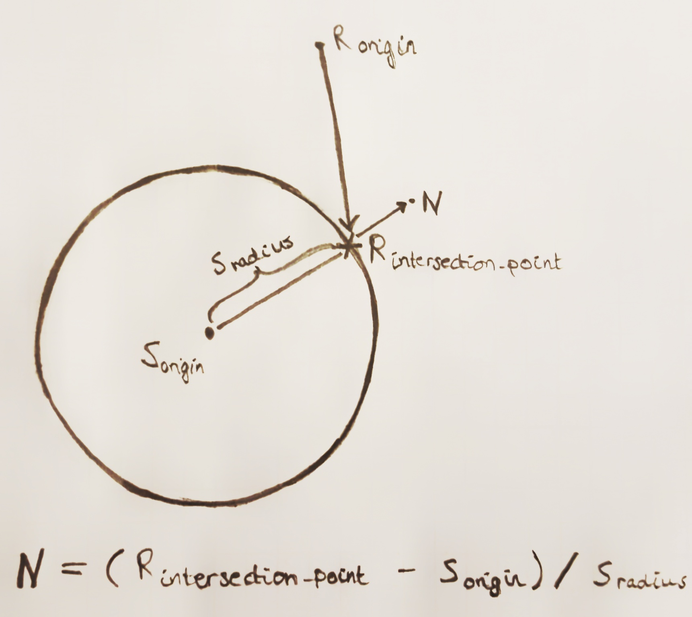

# rrt-fagkveld

The goal of this workshop is to introduce you to two (hopefully) new things.

1. The Rust programming language
2. Ray tracing

Rust is a systems programming language that focuses on high performance and memory safety.
By leveraging zero-cost abstractions and a strict compiler, the languages goes a long way of providing and ensuring these two things.

A ray tracer is a program that renders a scene by approximating actual light rays and their path through the physical world.
We can use the light gathered by the randomly scattered rays through our scene, so that we are able to project them back to a 2d pixel grid defined by a camera, as illustrated in the picture below.


This workshop contains a partly implemented ray tracer that is written in Rust.
Your goal is to finish the tasks that will bring you through the different steps necessary for a basic ray tracer, and by the end of the workshop you should be able to generate some nice looking images!

## Step 1 - Vectors
At the core of a ray tracer lies vector operations.
This includes addition between vectors and scalars, and other operations like multiplication and division.
The `Vec3` class (a 3-dimensional vector) is implemented in the `src/vec.rs` file, and it contains most of the vector operations that we need for our ray tracer.

**Step 1** of our ray tracer is to implement the missing vector operations!
Go to `src/vec.rs` and look for the code that starts with `panic!("Step 1...")`.
`panic!` is a Rust macro (you can see that by the exclamation mark), and Rust will exit the program immediately when it is encountered at run-time.

*Hint: You can look at the implementation of the other vector operations in the file if you're not sure about the implementation details.*

**Verification step:** run the `cargo test` command and verify that all tests labeled `test_1...` run successfully.

## Step 2 - A gradient image
Now that we have implemented the core math our ray tracer, it is time to generate an image - we will start by implementing a simple gradient "sky" for our scene.

**Step 2a**, we need to set up a camera so that we can capture an image of our scene, head to `src/main.rs` to figure out the missing values and initialize the Camera.
As you can see, the `main` function is rather simple.
All it does is initialize our camera and a scene, and calls the `trace_scene` library routine, which in turn gives us an image of the scene from the view point of the camera.

**Step 2b**, head to the `src/lib.rs` and navigate to the `trace_scene` library function - this function contains the main loop of the ray tracer.
This is where we initialize a new image and loop through all of its pixels, casting a new ray into the scene by calling the `trace_ray_in_scene` function.
As you can see, our work here is not yet done, you need to make sure the `trace_ray_in_scene` function actually gets called and returns the gradient!

**Verification step:** run the `cargo run` command and verify that your program executes *without* panicking!
Does it?
If so, navigate to the project directory and open the `scene.bmp` image.
**The image should be a gradient of light blue and white.**

*Does it not run without panicking? Then look over and make sure that all panics marked `Step 2x)` have been fixed, or contact one of the helpful persons to help you!*

## Step 3 - Intersection betwen Rays and Spheres

Even though we now have an image, it is not very exciting to look at.
The next essential step of a ray tracer is `Ray`-`Intersectable` intersection!
Without it, we will not be able to display our `Intersectables` and their colors.

Open the `src/scene.rs` file and take a couple of moments to reflect over the `Intersectable` trait found in the top of the file.
We can see that the trait contains two function signatures that are important to the core of the ray tracing algorithm:
* **intersects()** is a function that takes in a `Ray` (in addition to a min and max limit value that helps us determine if the `Ray` intersects or not), and returns an optional `Intersection` struct.
The returned `Intersection` contains the intersection point, the surface normal at the intersection, and the shape that was intersected. This helps us trace new rays recursively from the intersection point on the `Intersectable`.
* **scatter()** is a function that takes a `Ray` and an `Intersection` as arguments, and returns the `Color` of the `Intersectable`, in addition to a new `Ray` starting from the intersection point and pointing further into the scene.

Further down in this file we can see two structs that implement this trait; the `Scene` and the `Sphere`.
The `Scene` simply loops over all its `Intersectable`'s and returns the one that is closest to the origin of the `Ray`.
The `Sphere` intersection is mostly implemented, but you have to do the math for the `Intersection`.

**Step 3a**, complete the implementation of the `point_along_direction` function on the `Ray` stuct found in `src/ray.rs`.

**Step 3b**, complete the implementation of the surface normal in the `create_intersection` function accordning to the illustration below.



**Step 3c**, now that we have done the necessary calculations, we need to actually trigger the `Intersection` between the initial `Ray` and the `Scene`.
Open `src/lib.rs` and navigate back to the `trace_ray_in_scene` function.
Now call the `intersects()` function on the `scene` instead of returning the gradient as you currently do.
Since the `intersects()` function returns an `Option<Intersection>`, we will need to handle both of the cases of the value and map it to a `Color` - this is easly done with a `match` expression!
The `trace_ray_in_scene()` function should now look like this:

```rust
fn trace_ray_in_scene(ray: &Ray, scene: &Scene, depth: u32) -> Color {
    if depth == 50 {
        return Color::black(); // Return black to avoid being stuck with an unlimited recursion
    }
    match scene.intersects(ray, 0.0, f64::MAX) {
        Some(intersection) => {
            Color::black()
        }
        None => gradient(ray),
    }
}
```

**Verification step:** run the `cargo test` command and verify that the tests labelled `step_3...` run successfully.
When they do, run the `cargo run` command and look at your picture again.

*The image should now be ~60% black, but the gradient "sky" should still be visible at the top of the image.*
*Is this not what you see? Then ask someone for help, this is where the fun starts! :-)*

## Step 4 - Scatter new rays
We are now almost done with the implementation of our ray tracer!
Now, instead of returning `Color::black()` when your ray intersects with the scene, call the `scatter()` function like so: `intersection.shape.scatter(ray, &intersection)`.

**Step 4a** - remember that the call to `scatter()` returns an `Option<(Color, Ray)>`?
You need to handle this value similarly to what you did in **Step 3c** - return this color instead of black when `scatter()` returns `Some` value, but you can still return black the value returned from `scatter()` is `None`.

*What does your picture look like now? You should be able to see some pretty sorry looking `Spheres`!*

**Step 4b**, our picture has spheres, but just barely.
The next essential step in the ray tracing algorithm we're implementing is *recursion*.
The `scatter()` function returns a new `Ray` with the origin set to the intersection point, but with a new random direction.
All you need to do is to multiply the *scattered color* with the new color value obtained by calling `trace_ray_in_scene()` recursively, with the *scattered ray* as its parameter.

*The picture should now start to look pretty good, albeit also pretty grainy.*

**Step 4c**, we have a very easy fix for this:
Open up `src/main.rs` and give `num_samples` a higher value than 1, what about 100?
**Or if you're feeling ambitious** you can set it to 1000 - but be warned, it might take a little while!

**Verification step:** If you're seeing an (objectively) awesome picture, you're done!
You have (partially) implemented your own ray tracer, and as you can see, it does not require many steps to implement a simple one like this!

*Do you not think what you see is very awesome? It might be that you have done something wrong, or you might not not think that spheres are as awesome as some of us others do. Either way, let someone know so they can help you with your concerns!*

## Looking Further
Our ray tracer is done for now, but that does not mean that we are done with cool things.
